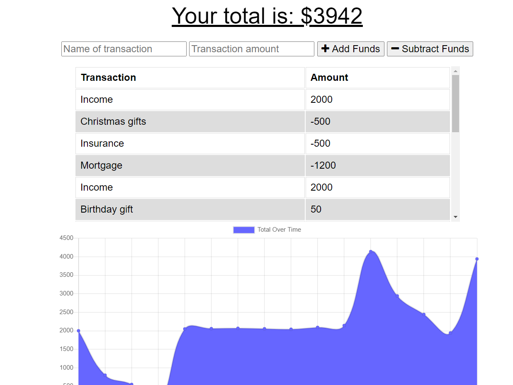

# budget-tracker   
## Description  
This is a progressive web app that allows you to track your your income and expenses and graph them in a simple chart.  Being a progressive web app it will work even if you are offline and then sync up with the database once you return to online status. 
 

## Table of Contents
  * [Description](#Description)
  * [Installation](#Installation)
  * [Usage](#Usage)
  * [License](#License)
  * [Contributing](#Contributing)
  * [Test](#Tests)
  * [Questions](#Questions)
 

## Screenshots

## Installation
Clone the repo from https://github.com/jburz/budget-tracker.  
 

## Usage
Run npm run start in your console and navigate to localhost:3000.  Alternatively, you can visit the deployed app on heroku: https://quiet-cliffs-27313.herokuapp.com/
 

## License
This application is covered under the [MIT](https://www.opensource.org/licenses) license.
 

## Contributing
Please submit any issues through the github repo issues tracker.
 

## Tests
There are no test instructions for this app.
 

## Questions
If you have any questions, feel free to find me on github, [jburz](https://www.github.com/jburz) or send me an email at jake.bilbao.04.06@gmail.com.
  